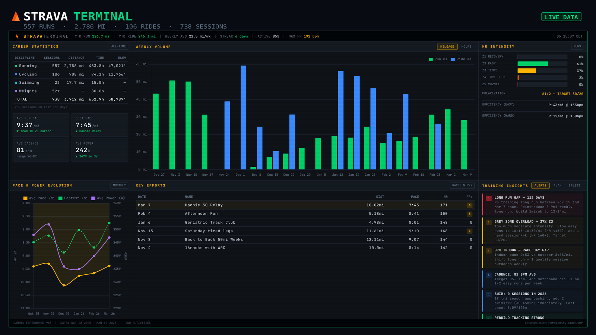
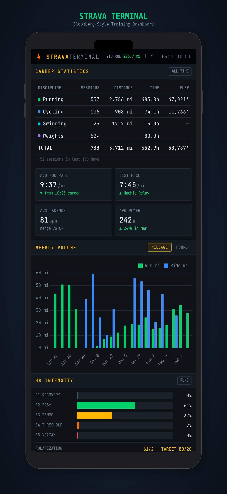

# STRAVA TERMINAL

A Bloomberg Terminal-style dashboard for your Strava training data. Dark, data-dense, and fully interactive.



## Features

- **Career Statistics** — All-time totals across running, cycling, swimming, and weights
- **Weekly Volume** — Stacked bar chart with mileage/hours toggle
- **HR Intensity** — Zone distribution bars with polarization analysis
- **Pace & Power Evolution** — Monthly trend lines with dual Y-axis
- **Key Efforts** — Race results and PR highlights
- **Training Insights** — Alerts, weekly plan, and indoor/outdoor splits
- **Live Clock** — Real-time timestamp in terminal style
- **Responsive** — Stacks cleanly on mobile and tablet viewports

## Screenshots

<p align="center">
  
</p>

## Quick Start

1. **Clone the repo**
   ```bash
   git clone https://github.com/buloxdev/strava-terminal.git
   cd strava-terminal
   ```

2. **Edit your data**  
   Open `data/sample-data.json` and replace the values with your own Strava stats. The JSON structure is self-explanatory — career totals, weekly volumes, pace data, key efforts, and training insights.

3. **Serve locally**
   ```bash
   # Any static file server works. Examples:
   npx serve .
   # or
   python3 -m http.server 3000
   ```

4. **Open** local host in your browser.

## Project Structure

```
strava-terminal/
├── index.html              # Dashboard layout (template)
├── styles.css              # Full CSS — dark terminal theme
├── app.js                  # Chart.js charts, data loading, interactivity
├── data/
│   └── sample-data.json    # ← Your training data goes here
├── screenshots/
│   ├── twitter-card.png    # Social sharing image (1600×900)
│   └── iphone-mockup.png   # iPhone device mockup
├── .env.example            # Template for Strava API credentials
├── .gitignore
├── LICENSE
└── README.md
```

## Customizing Your Data

All dashboard data lives in `data/sample-data.json`. Edit these sections:

| Section | What It Controls |
|---------|-----------------|
| `athlete` | Device name, date range, activity count (shown in footer) |
| `ticker` | Top scrolling bar — YTD stats, streak, active % |
| `career` | Career statistics table — sessions, distance, time, elevation |
| `kpis` | Four KPI cards — pace, cadence, power |
| `hrZones` | Heart rate zone distribution bars + polarization |
| `weeklyVolume` | Bar chart data — weekly miles and hours |
| `paceEvolution` | Line chart — monthly pace and power trends |
| `keyEfforts` | Efforts table — races, PRs, notable sessions |
| `trainingInsights.alerts` | Alert cards with severity levels |
| `distribution` | Doughnut chart — time split by activity type |

## Connecting to the Strava API (Optional)

To pull data automatically from Strava instead of editing JSON manually:

1. **Create a Strava API Application**  
   Go to [strava.com/settings/api](https://www.strava.com/settings/api) and create an app.  
   Note your **Client ID** and **Client Secret**.

2. **Get a Refresh Token**  
   Follow Strava's [OAuth flow](https://developers.strava.com/docs/getting-started/) to get a refresh token with `activity:read_all` scope.

3. **Set up your `.env`**
   ```bash
   cp .env.example .env
   ```
   Fill in your credentials. **Never commit this file** — it's in `.gitignore`.

4. **Build a data fetcher**  
   Write a script (Python, Node, etc.) that:
   - Exchanges the refresh token for an access token
   - Calls `GET /api/v3/athletes/{id}/stats` for career totals
   - Calls `GET /api/v3/athlete/activities` for recent activities
   - Processes the data into the `sample-data.json` format
   - Saves to `data/sample-data.json`

   A Python example is in the wiki (coming soon).

## Tech Stack

- **HTML/CSS/JS** — No framework, no build step
- **Chart.js** — Charts via CDN
- **JetBrains Mono** — Terminal monospace font via Google Fonts
- Zero dependencies to install

## License

MIT — see [LICENSE](LICENSE).

---

Built with [Perplexity Computer](https://www.perplexity.ai/computer).
